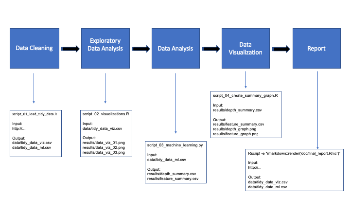

# Proposal

## Team Members

[Olivia Lin](https://github.com/olivia-lin) <br>
[Mani Kohli](https://github.com/ksm45)


## Introduction
There are huge disparities in salary amongst the population today. Why does someone receive a higher salary than the next person? There could be many, many factors as to why.  How do we narrow down these factors?  One approach would be to analyze collected data from censuses which would give us pre-defined attributes, including salaries. 

Our research proposal for this project is to determine what are the strongest predictors (attributes) would be to determine a salary greater than $50,000.  

Our goal is to build a model on census data for a specific year with the hopes that it could be applied on other years as well.

## Dataset
The public data set for our project is https://archive.ics.uci.edu/ml/datasets/Adult from UCI machine learning repository. The data for this project is from the 1994 US Census Database. 

**Dataset Attributes**
"age", "workclass", "fnlwgt", "education", "educationNum", "married", "occupation", "relationship", "race",  "sex", "capitalGain", "capitalLoss", "hrPerWeek", "nativeCountry", "income"

Script to load the dataset: [R script](https://github.com/UBC-MDS/DSCI_522_Income_Prediction/tree/master/src)  
Dataset file: [Data](https://github.com/UBC-MDS/DSCI_522_Income_Prediction/tree/master/data)  

## Research Question
Our research proposal for this project is to determine, *what are the strongest attributes to determine a salary greater than $50,000?* This will be a predictive question.

## Plan

WorkFlow for our project:  
  
  
  
  
  
- load the dataset into R 
- explore the dataset
- data wrangling to clean and prepare the data according to our research project
- divide the dataset into training and testing
- use a decision tree algorithm on the training set
- apply the resulting model to the testing set

We choose to use a decision tree model because we wanted to know which specific features were used to classify our target value. In addition, this gave us the rules that helped predict our target variable.

## Summary
- compare the testing statistics to the training statistics (ex. accuracy) in a table or visualization such as a tree
- return to the decision trees to determine the strongest attributes leading to a salary greater than $50,000.  

## Final Report
Our final report is [here](https://github.com/UBC-MDS/DSCI_522_Income_Prediction/blob/master/doc/final_report.md).

## Scripts
Our scripts can be found [here](https://github.com/UBC-MDS/DSCI_522_Income_Prediction/tree/master/src). For usage of these scripts, please reference the `Usage` description in the comment section of each script. These scripts should be run under the root directory of our project. To run each script, copy the code after `Example:`, in the comment section at the beginning of each script, into terminal.

## Usage

### Method 1 Run the analysis using shell script

Each script should be run under the root directory of this project. 

In a command line, run the following code to load tidy data: 
``` Rscript src/script_01_load_tidy_data.R https://archive.ics.uci.edu/ml/machine-learning-databases/adult/adult.data data/tidy_data_viz.csv data/tidy_data_ml.csv```

Run the following code to generate visualizations:
```Rscript src/script_02_visualizations.R data/tidy_data_viz.csv results/data_viz_01.png results/data_viz_02.png results/data_viz_03.png```

Run the following code to do machine learning and create summary tables:
```python src/script_03_machine_learning.py data/tidy_data_ml.csv results/depth_summary.csv results/feature_summary.csv results/tree_model```

Run the following code to create summary graphs:
```Rscript src/script_04_create_summary_graph.R results/depth_summary.csv results/feature_summary.csv results/depth_graph.png results/feature_graph.png```

### Method 2 Run the analysis using make
The makefile should be run under the root directory of this project. In a command line, run the following code to run the makefile:
```make all```

### Method 3 Run the analysis using docker
1. Install Docker
2. Download and clone this repository
3. Run the following code in terminal to download the Docker image:
```docker pull olivialin/dsci_522_income_prediction```
4. Use the command line to navigate to the root of this repo
5. Type the following code into terminal to run the analysis:
```docker run --rm -e PASSWORD=income -v /Users/olivia/Documents/MDS/522/DSCI_522_Income_Prediction:/home/income incomeprediction:2.2 make -C 'home/income' all```
6. If you would like a fresh start, type the following:
```docker run --rm -e PASSWORD=income -v /Users/olivia/Documents/MDS/522/DSCI_522_Income_Prediction:/home/income incomeprediction:2.2 make -C 'home/income' clean```


## Dependencies

**R Packages:** 

- tidyverse (v1.2.1)
- ggplot2 (v3.0.0)

**Python Packages:**
- pandas (v0.23.0)
- sklearn (v0.19.1)
- matplotlib (v2.2.2)
- argparse (v3.2)

## Release Versions  

| Versions | Link to project version |
| ---- | ---------------|
| Version 0.0 | [v0.0](https://github.com/UBC-MDS/DSCI_522_Income_Prediction/tree/v0.0) |
|     |         |
| Version 1.0.1 | [v1.0.1](https://github.com/UBC-MDS/DSCI_522_Income_Prediction/tree/v1.0.1) |
|     |         |
| Version 2.0.0 | [v2.0.0](https://github.com/UBC-MDS/DSCI_522_Income_Prediction/tree/v.2.0.0) | 
|     |         |
| Version 2.1.0 | [v2.1.0](https://github.com/UBC-MDS/DSCI_522_Income_Prediction/tree/v.2.1.0) |  
|     |         |
| Version 2.1.0 | [v2.2.0](https://github.com/UBC-MDS/DSCI_522_Income_Prediction/tree/v.2.2.0) | 

