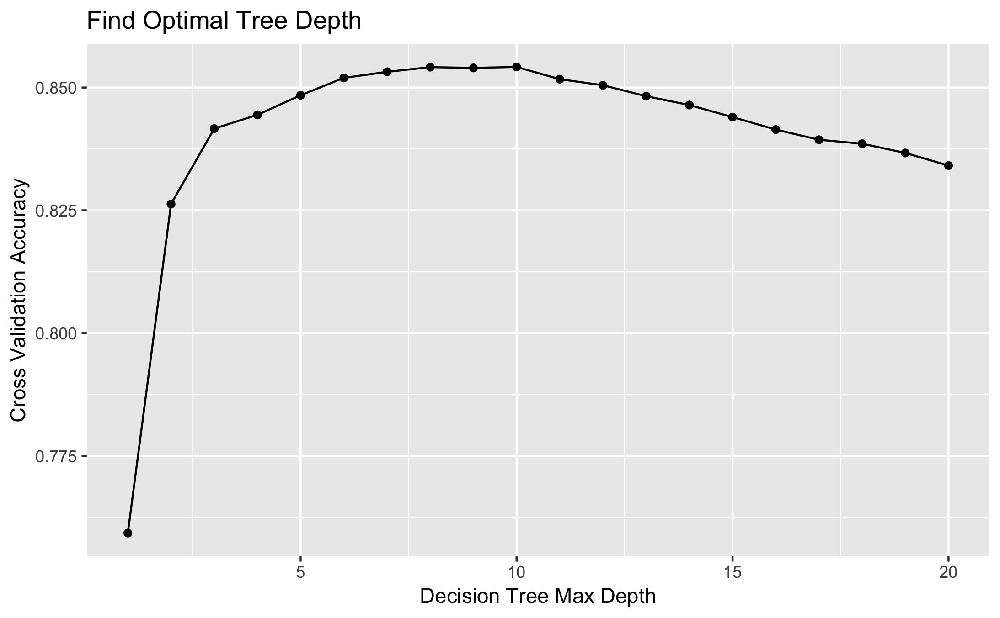
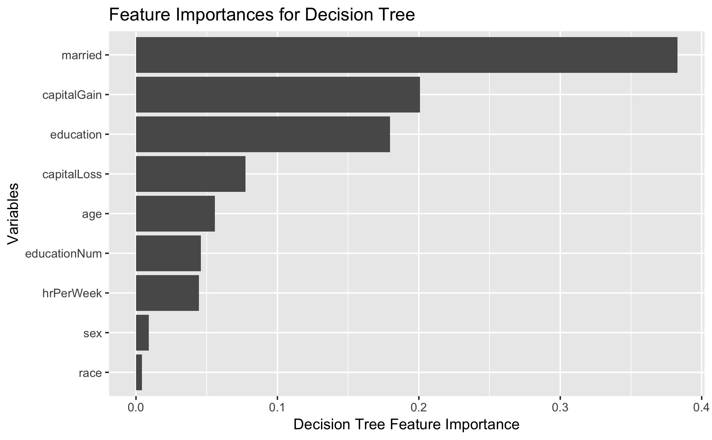

```{r setup, include=FALSE}
knitr::opts_chunk$set(echo = TRUE)
```

## Introduction

Our research proposal for this project is to determine, what are the strongest attributes to determine a salary greater than $50,000? This will be a predictive question.


## Data Set and Wrangling
The public data set for our project is https://archive.ics.uci.edu/ml/datasets/Adult from UCI machine learning repository. The data for this project is from the 1994 US Census Database. 

```{r variables, echo=FALSE}
variables <- tibble::tribble(
~Attributes, ~Description,
'age', 'continuous',
'workclass', 'Private, Self-emp-not-inc, Self-emp-inc, Federal-gov, Local-gov, State-gov, Without-pay, Never-worked.',
'fnlwgt', 'continuous',
'education', 'Bachelors, Some-college, 11th, HS-grad, Prof-school, Assoc-acdm, Assoc-voc, 9th, 7th-8th, 12th, Masters, 1st-4th, 10th, Doctorate, 5th-6th, Preschool', 
'education-num', 'continuous', 
'marital-status', 'Married-civ-spouse, Divorced, Never-married, Separated, Widowed, Married-spouse-absent, Married-AF-spouse', 
'occupation', 'Tech-support, Craft-repair, Other-service, Sales, Exec-managerial, Prof-specialty, Handlers-cleaners, Machine-op-inspct, Adm-clerical, Farming-fishing, Transport-moving, Priv-house-serv, Protective-serv, Armed-Forces',
'relationship', 'Wife, Own-child, Husband, Not-in-family, Other-relative, Unmarried',
'race',  'White, Asian-Pac-Islander, Amer-Indian-Eskimo, Other, Black',
'sex', 'Female, Male', 
'capital-gain', 'continuous', 
'capital-loss', 'continuous', 
'hours-per-week', 'continuous', 
'native-country', 'United-States, Cambodia, England, Puerto-Rico, Canada, Germany, Outlying-US(Guam-USVI-etc), India, Japan, Greece, South, China, Cuba, Iran, Honduras, Philippines, Italy, Poland, Jamaica, Vietnam, Mexico, Portugal, Ireland, France, Dominican-Republic, Laos, Ecuador, Taiwan, Haiti, Columbia, Hungary, Guatemala, Nicaragua, Scotland, Thailand, Yugoslavia, El-Salvador, Trinadad&Tobago, Peru, Hong, Holand-Netherlands'
)
knitr::kable(variables)
```


## Exploratory Data Analysis

## Methodology

To answer our proposal question, we used decision tree classifier from `scikit-learn` package. We followed the steps listed below to build our decision tree classifier:

-	Separated cleaned data into features `X` and target `y` (income level)
-	Split the data set into training and testing sets (we are using 80% for training and 20% for testing)
-	Perform 5-fold cross validation on the training set to find the optimal value (range from 1 to 20) of max depth parameter for the decision tree in regard of accuracy
-	Build the decision tree model using the optimal max depth parameter as we find using cross validation accuracy
-	Predict income level using testing set and report the accuracy of this model

## Results



The optimal max depth we found is 10 steps. The accuracy of our training set is 86.48% and the accuracy of our testing set is 85.66% which shows that our decision tree does a decent job predicting the income level.



To answer our proposal question, we looked at feature importances of the decision tree. We found that the most influential factors of the income level are marriage status, capital gain, and education level. The feature importance is about 40% for marriage status  and 20% for capital gain and education level.

## Limitations

- More data required for stronger predictions
- Incomplete data due to missing values
- Puzzling data wrangling to original data (for the feature education, the original data set breaks people didn’t graduate from high school into groups such as 10th and 11th grade, we combine all people didn’t graduate from high school into one group)
- Limited values for categorical variables (race only has five categories)
- Data collected from 1994 may be different from data collected more recently (more categories in sex)

## Future Direction

-	Convert categorical variables to numeric variables in a more meaningful way
-	Try a different classification approach, such as k-NN, and compare results
-	Use a more recent data set

## References


