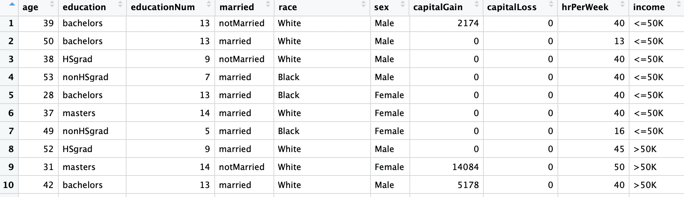
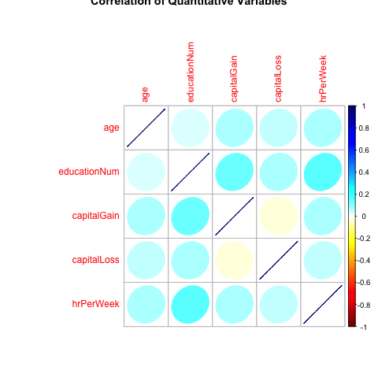
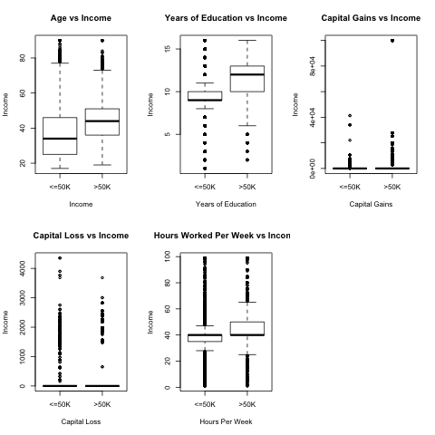
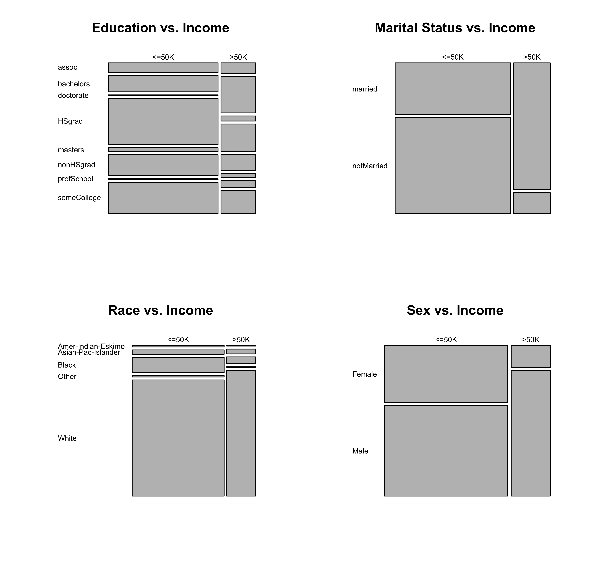

```{r setup, include=FALSE}
knitr::opts_chunk$set(echo = TRUE)
```

## Introduction

There are huge disparities in salary amongst the population today. Why does someone receive a higher salary than the next person? There could be many, many factors as to why. How could a person benefit from these factors in order to gain a higher salary?  One approach would be to analyze collected data from censuses with a pre-defined set of attributes, including salaries.

The research proposal for this project is to determine which are the strongest predictors (attributes) that could be used to determine a salary greater than $50,000.  

The goal of this project is to build a model on the census data for a specific year with the hopes that it could be applied to future cencus data as well.

## Data Set and Wrangling
The public data set for this project is https://archive.ics.uci.edu/ml/datasets/Adult from UCI machine learning repository. The data used for this project is collected from the 1994 US Census Database.

<br><br>
```{r tableRawData, echo=FALSE, out.width = '100%', fig.align='center'}

```  
<center>Table 1: Cleaned raw data from the 1994 US Census</center>
<br><br>
The final data consists of 9 attributes, 5 are numerical and 4 are categorical.

```{r variables, echo=FALSE}
variables <- tibble::tribble(
~Attributes, ~Description,
'age', 'Age of an individual (continuous range from 17-90 years old)',
'education', 'The highest level of education achieved by an individual (Bachelors, Some-college, 11th, HS-grad, Prof-school, Assoc-acdm, Assoc-voc, 9th, 7th-8th, 12th, Masters, 1st-4th, 10th, Doctorate, 5th-6th, Preschool)',
'educationNum', 'The highest level of education achieved in numerical (continuous) form',
'married', 'Marital status of an individual (Married-civ-spouse, Divorced, Never-married, Separated, Widowed, Married-spouse-absent, Married-AF-spouse)',
'race',  'Descriptions of an individual’s race (White, Asian-Pac-Islander, Amer-Indian-Eskimo, Other, Black)',
'sex', 'The biological sex of the individual (Female, Male)',
'capitalGain', 'Capital gains (continuous integer, greater than 0) for an individual',
'capitalLoss', 'Capital loss (continuous integer, greater than 0) for an individual',
'hrPerWeek', 'The hours (continuous) an individual has reported to work per week',
'income', 'Whether or not an individual makes more than $50,000 annually (<=50k, >50k)'
)
knitr::kable(variables)
```

Based on the initial analysis of the data set, the following features were omitted:

-	Workclass: Did not offer meaningful data. Defined categories were not descriptive (too limited).
- Fnlwgt: Not useful for this project. Data was highly skewed with zeros.
-	Occupation: Did not offer meaningful data. Defined categories were not descriptive (too limited).
-	Relationship: Did not offer meaningful data. Defined categories were not descriptive (too limited and repetitive with ‘marital-status’). 
-	native-country: Not useful for this project.


Two separate 'cleaned' data sets were created. One for exploratory data analysis, containing defined string levels for categorical variables; One to be used for the machine learning model, containing numeric levels (converted from strings levels).

## Exploratory Data Analysis

Although the initial data exploration included analyzing visualizations of distributions for all the variables separately, they were not used in our final report (for more information please see script02_visualizations.R). They did however provide us with information which led to the plots below.  


```{r plot1a, echo=FALSE, out.width = '50%', fig.align='center'}

```
<center>Figure 1a: Relationship of Quantitative Variables</center>


```{r plot1b, echo=FALSE, out.width = '50%', fig.align='center'}
knitr::include_graphics("../results/data_viz_04.png")
```
<center>Figure 1b: Relationship of Categorical Variables</center>

Figure 1a and 1b provides correlation information between the all of the quantitative variables (1a) and all of the categorical variables (1b). Visualizing correlations separately helped identify possible relationships between variables amongst each other.

```{r plot2, echo=FALSE, out.width = '80%', fig.align='center'}

```
<center>Figure 2: Quantitative variables vs the target (income) variable</center>

Figure 2 gives a 5 number summary between each quantitative variable and the target (income) variable. Age and Years of education with income appear to show the greatest difference in medians.

```{r plot3, echo=FALSE, out.width = '70%', fig.align='center'}

```
<center>Figure 3: Categorical variables vs the target (income) variable</center>

Figure 3 gives the relationships between each categorical variable and the target (income) variable.

From these plots we can see marriage and education have stronger relationships with our target income variable. Marital status, Race and Sex show clear categorical levels with higher frequencies with higher income levels. 

## Methodology

To answer the proposal question, a decision tree classifier was used from the `scikit-learn` package. The following steps were used to build the decision tree classifier:

1. Separated cleaned data into features `X` and target `y` (income level)
2. Split the data set into training and testing sets (we are using 80% for training and 20% for testing)
3. Perform 5-fold cross validation on the training set to find the optimal value (range from 1 to 20) of max depth parameter for the decision tree in regard of accuracy
4. Build the decision tree model using the optimal max depth parameter found using cross validation accuracy
5. Predict income level using testing set
6. Report the accuracy of this model

This decision tree model was choosen in order to specify which features were used to classify the target value. In addition, this model also helped define rules which helped predict the target variable.

## Results

```{r plot4, echo=FALSE, out.width = '55%', fig.align='center'}
knitr::include_graphics("../results/depth_graph.png")
```
<center>Figure 4: Decision Tree Depth vs Accuracy</center>

The optimal max depth found was 10 steps. The accuracy of the training set was 86.48% and the accuracy of the testing set was 85.66%, showing that the decision tree did a decent job predicting the target income level.


```{r plot5, echo=FALSE, out.width = '60%', fig.align='center'}
knitr::include_graphics("../results/feature_graph.png")
```
<center>Figure 5: Feature Importances for Decision Tree</center>

To answer the proposal question, feature importances of the decision tree were looked at. The most influential factors of the income level were **marriage status, capital gain, and education level**. The feature importance was about 40% for marriage status and 20% for capital gain and education level.

In conclusion, the strongest predictors for gaining a higher income were individuals who were married, have some sort of capital gain and completed some level of education.  

## Limitations

Firstly, more data was required for stronger predictions. The data used was incomplete with missing values which may had affected the result. Secondly, 'puzzling' data wrangling used on the original data. For example, for the feature education, the original data set was broken into different levels high school completed such as 10th and 11th grade. In this project, all people who didn’t graduate from high school were grouped as 'non high school graduates'. Thirdly, there were limited levels for certain categorical variables, such as race, which only had five levels. Lastly, the dataset being used for this project was collected from 1994. This may differ from data collected today, such as more categories for sex and race. A more recent dataset may help readers relate to the data better.

## Future Direction

Firstly, converting categorical variables to numeric variables in a more meaningful way may help explore the data much deeper. Secondly, implementing more classification methods, such as k-NN, would help compare the results with the decision tree used in this project. Finally, analysis on more recent datasets would help relate the results to a broader population.

## References

https://github.ubc.ca/mds-2018-19/DSCI_571_sup-learn-1_students  
https://archive.ics.uci.edu/ml/datasets/Adult  
https://archive.ics.uci.edu/ml/machine-learning-databases/adult/adult.names  
http://individual.utoronto.ca/zabet/census-income.html  
http://jmcauley.ucsd.edu/cse190/projects/sp15/048.pdf  
