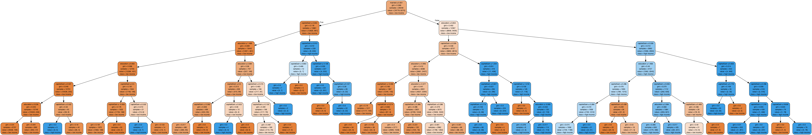

Income Prediction Using Decision Tree
================
Olivia Lin, Mani Kohli
November 24, 2018

Introduction
------------

There are huge disparities in salary amongst the population today. Why does someone receive a higher salary than the next person? There could be many, many factors as to why. How do we narrow down these factors? One approach would be to analyze collected data from censuses which would give us pre-defined attributes, including salaries.

Our research proposal for this project is to determine what are the strongest predictors (attributes) would be to determine a salary greater than $50,000.

Our goal is to build a model on census data for a specific year with the hopes that it could be applied on other years as well.

Data Set and Wrangling
----------------------

The public data set for our project is <https://archive.ics.uci.edu/ml/datasets/Adult> from UCI machine learning repository. The data we will use for this project is from the 1994 US Census Database.

Based on our initial analysis of the data set, we omitted various features for the following reasons:

-   Workclass: We felt this attribute did not offered meaningful data, the defined categories were not descriptive and too limited.
-   Fnlwgt: This attribute was not useful for our purpose and was highly skewed with zeros.
-   Occupation: We felt this attribute did not offered meaningful data, the defined categories were not descriptive and too limited.
-   Relationship: We felt this attribute did not offered meaningful data, the defined categories were not descriptive and too limited and partially repetitive with ‘marital-status’.
-   native-country: This attribute was not useful for our purpose.

Our final data set consisted of 9 attributes, 5 were numerical and 4 were categorical.

| Attributes   | Description                                                                                                                                                                                                      |
|:-------------|:-----------------------------------------------------------------------------------------------------------------------------------------------------------------------------------------------------------------|
| age          | Age of an individual (continuous range from 17-90 years old)                                                                                                                                                     |
| education    | The highest level of education achieved by an individual (Bachelors, Some-college, 11th, HS-grad, Prof-school, Assoc-acdm, Assoc-voc, 9th, 7th-8th, 12th, Masters, 1st-4th, 10th, Doctorate, 5th-6th, Preschool) |
| educationNum | The highest level of education achieved in numerical (continuous) form                                                                                                                                           |
| married      | Marital status of an individual (Married-civ-spouse, Divorced, Never-married, Separated, Widowed, Married-spouse-absent, Married-AF-spouse)                                                                      |
| race         | Descriptions of an individual’s race (White, Asian-Pac-Islander, Amer-Indian-Eskimo, Other, Black)                                                                                                               |
| sex          | The biological sex of the individual (Female, Male)                                                                                                                                                              |
| capitalGain  | Capital gains (continuous integer, greater than 0) for an individual                                                                                                                                             |
| capitalLoss  | Capital loss (continuous integer, greater than 0) for an individual                                                                                                                                              |
| hrPerWeek    | The hours (continuous) an individual has reported to work per week                                                                                                                                               |
| income       | Whether or not an individual makes more than $50,000 annually (&lt;=50k, &gt;50k)                                                                                                                                |

We created two separate data sets for cleaned version. One for exploratory data analysis which used our defined string levels for categorical variables; one for our machine learning model which we converted the string levels to numeric levels.

Exploratory Data Analysis
-------------------------

Although our initial data exploration included analyzing visualizations of distributions for all the variables separately, they were not used in our final report (for more information please see script02\_visualizations.R). They did however provide us with information which led to the plots below.

Figure 1: Correlation of Quantitative Variables

Figure 1 provides us with correlation information between each quantitative variable amongst each other. This helped us with visualizing how correlated these variables were to each other.

Figure 2: Quantitative variables vs our target variable

Figure 2 gives us a 5 number summary description between each quantitative variable and the target variable.

Figure 3: Categorical variables vs our target variable

Figure 3 shows us the relationships between each categorical variable and the target variable.

From these plots we can see marriage and education have stronger relationships with our target income variable.

Methodology
-----------

To answer our proposal question, we used decision tree classifier from `scikit-learn` package. We followed the steps listed below to build our decision tree classifier:

-   Separated cleaned data into features `X` and target `y` (income level)
-   Split the data set into training and testing sets (we are using 80% for training and 20% for testing)
-   Perform 5-fold cross validation on the training set to find the optimal value (range from 1 to 20) of max depth parameter for the decision tree in regard of accuracy
-   Build the decision tree model using the optimal max depth parameter found using cross validation accuracy
-   Predict income level using testing set
-   Report the accuracy of this model

We choose to use this decision tree model because we wanted to know which specific features were used to classify our target value. In addition, this gave us the rules that helped predict our target variable.

Results
-------

Figure 4: Decision Tree Depth vs Accuracy

The optimal max depth we found is 10 steps. The accuracy of our training set is 86.48% and the accuracy of our testing set is 85.66% which shows that our decision tree does a decent job predicting the income level.

Figure 5: Feature Importances for Decision Tree

To answer our proposal question, we looked at feature importances of the decision tree. We found that the most influential factors of the income level are marriage status, capital gain, and education level. The feature importance is about 40% for marriage status and 20% for capital gain and education level.
  
  

  
      
      
Figure 6: Decision Tree Model

Figture 6 shows the decision tree model. For the purpose of readable graph, we picked the three most important features, which are marriage status, capital gain, and education level. According to the Figure 4, even though tree with depth 10 has the highest accuracy, we decided to use depth 6 because ploting tree with depth 10 is less readable. In addtion, the accuracy score for depth 10 and 6 are close.

In conclusion, the strongest predictors for gaining a higher income are individuals who are married, have some sort of capital gain and completed some level of education.

Limitations
-----------

Firstly, we need more data required for stronger predictions. We also have incomplete data due to missing values which might affect our results.Secondly, there is puzzling data wrangling to original data. For example, for the feature education, the original data set breaks people didn’t graduate from high school into groups such as 10th and 11th grade. In this project, we combine all people didn’t graduate from high school into one group. Thirdly, there are limited levels for categorical variables, such as only five categories for race. Lastly, the dataset we are using for this project was collected from 1994, which may be different from data collected more recently, such as more categories for sex. A more recent dataset could make readers feel more related.

Future Direction
----------------

First, we want to convert categorical variables to numeric variables in a more meaningful way. Second, we would like to try different classification approaches, such as k-NN, and compare results with decision tree. Last but not least, we want to do this analysis on a more recent dataset.

References
----------

<https://github.ubc.ca/mds-2018-19/DSCI_571_sup-learn-1_students>  
<https://archive.ics.uci.edu/ml/datasets/Adult>  
<https://archive.ics.uci.edu/ml/machine-learning-databases/adult/adult.names>  
<http://individual.utoronto.ca/zabet/census-income.html>  
<http://jmcauley.ucsd.edu/cse190/projects/sp15/048.pdf>  

